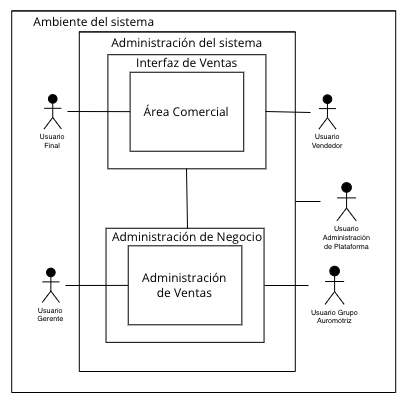
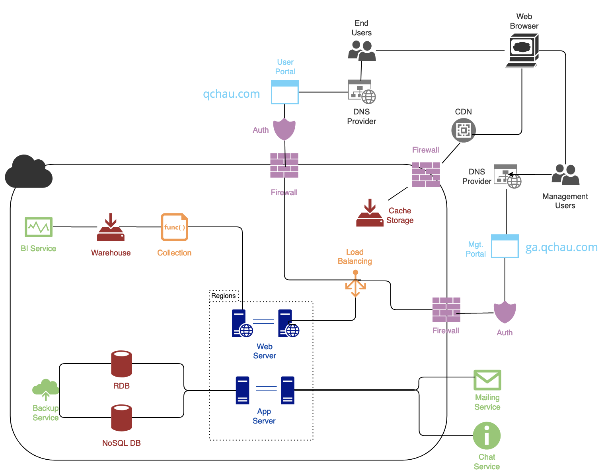
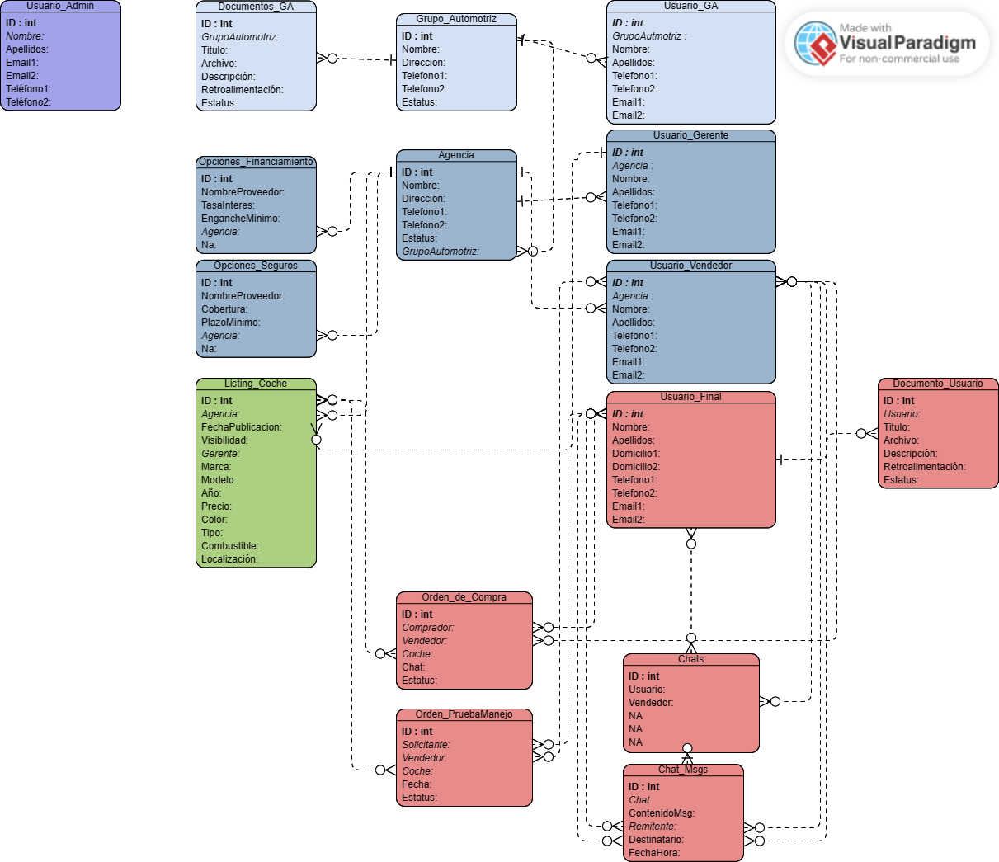

# **Especificación de Requerimientos de Software para NDS Cognitive Labs**
Versión 1.0

_Preparado por:_
- Ana Paula Katsuda Zalce
- Sebastián González Villacorta
- Gerardo Gutiérrez Paniagua
- Luis Javier Karam
- Francisco Salcedo Catalán

### ITESM
### 9 de Marzo del 2023

---
## _Tabla de Contenidos_
1. [Introducción](#introducción)
    1. [Propósito](#propósito)
    2. [Convenciones del Documento](#convenciones-del-documento)
    3. [Alcance del Proyecto](#alcance-del-proyecto)
    4. [Objetivos de QChau Software](#objetivos-de-qchau-software)
    5. [Referencias](#referencias)
2. [Descripción General](#descripción-general)
    1. [Perspectiva de Producto](#perspectiva-del-producto)
    2. [Clases de Usuario y Características](#clases-de-usuario-y-características)
    3. [Ambiente de Operación](#ambiente-de-operación)
        - [Interaccionescon la Aplicación](#interacciones-con-la-aplicación)
        - [Arquitectura](#arquitectura)
        - [Tech Stack](#tech-stack)
    4. [Asunciones y Dependencias](#asunciones-y-dependencias)
3. [Características del Sistema](#caracteristicas-del-sistema)
4. [Requerimientos de Datos](#requerimientos-de-datos)
    1. [Estructura Lógica de los Datos](#estructura-lógica-de-los-datos)
    2. [Características de la Base de Datos](#características-de-la-base-de-datos)
    3. [Integridad y Seguridad de los Datos](#integridad-y-seguridad-de-los-datos)
5. [Requerimientos de la Interfaz Externa]()

6. [Atributos de Calidad](#atributos-de-calidad)
	1. [Usabilidad](#usabilidad)
	2. [Desempeño](#desempeño)
	3. [Seguridad](#seguridad) 
	4. [Protección](#proteccion)

---
## _Historial de Versiones_
| Nombre       | Fecha     | Razones de cambios | Version |
|--------------|-----------|------------|------|
| Ana Paula Katsuda Zalce | 6 de Marzo del 2023 | Comienzo de redacción de las secciones introducción y descripción general | v1.0 |
| Sebastián González Villacorta | 8 de Marzo del 2023 | Comienzo de redacción de sección Requerimientos de Datos | v1.0 |
|  |  |  |  |

---
## _Introducción_
NDS Cognitive Labs es una empresa dedicada a la implementación de soluciones digitales en México. De manera específica, la empresa trabaja en temas tales como Inteligencia Artificial, Internet de las Cosas, la nube y analítica. Actualmente, NDS busca una plataforma capaz de facilitar la adquisición digital de autos.

Considerando las necesidades planteadas por NDS Cognitive Labs, la presente empresa - QChau Software - realizará un planteamiento de solución digital en este documento de Especificación de Requerimientos de Software (SRS). 

La introducción en este caso, tiene el objetivo de proveer una descripción general del documento, en donde se incluye el propósito, las convenciones del documento, el alcance del proyecto y las respectivas referencias. Con lo anterior, se logrará tener una mejor comprensión de la propuesta del proyecto y del análisis de necesidades para NDS Cognitive Labs en el que se desarrollará el sistema de compra de autos mencionado anteriormente. 

### _Propósito_
El propósito de este documento es detallar, analizar y definir el sistema de adquisición de autos (en su primera versión) que será propuesto a NDS Cognitive Labs de una manera clara y comprensible. En este caso, se describirán los requerimientos funcionales, los requerimientos no funcionales, las limitaciones del sistema y la interacción del sistema y el usuario. 

El documento será de gran utilidad para los Project Owners, Project Managers, desarrolladores y cualquier entidad que participe en la creación de la aplicación puesto a que se puede utilizar como un punto de partida para la misma.

### _Convenciones del Documento_
| Término | Definición |
|---------|------------|
|Especificación de Requerimientos de Software (SRS)| Un documento en el que se detallan las funcionalidades de un software.|
| PO | Product Owner |
| PM | Project Manager |

### _Alcance del Proyecto_
La aplicación planteada involucra un sistema de adquisición de autos de manera mayormente digital. El sistema será diseñado de manera que un usuario comprador pueda revisar catálogos de las marcas registradas (distintos grupos automotrices y agencias), solicitar pruebas de manejo, comparar autos, obtener estimaciones de precios (cotización), comenzar su proceso de compra desde la plataforma, subir la documentación necesaria, obtener retroalimentación de su documentación, comunicarse con agentes, y mantener un seguimiento de su compra.  
Asimismo, permitirá a grupos automotrices inscribirse y registrar sus agencias con sus respectivos gerentes y vendedores. De esta manera, los vendedores podrán dar seguimiento a las compras de sus clientes y los gerentes podrán tener un seguimiento administrativo (tal como la gestión de catálogos de autos) desde una plataforma intuitiva. 

La aplicación será de gran utilidad no solo para los compradores que quieran realizar sus compras digitalmente de una manera fácil y segura, sino también para las agencias y grupos automotrices que quieran aumentar el alcance de sus ventas utilizando herramientas tecnológicas. Todos los autos registrados en la plataforma estarán al alcance del usuario y se tendrá una atención con la misma calidad que la que se ofrece en una agencia. 

En cuanto a las limitaciones de la aplicación, es relevante mencionar que ésta es principalmente un medio de contacto digital y publicación de productos únicamente de agencias, por lo que no se gestionan procesos internos de cada agencia y grupo automotriz. Ahondando en lo anterior, las entidades involucradas en el desarrollo de la plataforma no tienen responsabilidades en cuanto a los acuerdos de pagos de mensualidades, las negociaciones realizadas por la agencia, la entrega ni el mantenimiento de los vehículos. 
### _Objetivos de QChau Software_

- Asegurar la integridad y accesibilidad de los sistemas informáticos involucrados.
- Diseñar el sistema de tal manera que la integración a través del mercado automovilístico sea fácil e intuitiva. 
- Desplegar los listados e información de una manera agradable, útil y eficiente para el usuario. 

### _Referencias_

---
## _Descripción General_
En la presente sección se incluyen las especificaciones generales del producto final, en donde se describirán detalles tales como los tipos de usuarios definidos para el proyecto, el ambiente del software, limitaciones, asumpciones, y dependencias. Lo anterior con la finalidad de obtener una mejor idea de las características y las consideraciones que se tienen que tomar para un correcto desarrollo. 

### _Perspectiva del Producto_
La necesidad del producto nace del proceso inconveniente para muchos clientes en la adquisición de un auto. En muchos casos, los clientes tienen que asistir múltiples veces a las agencias para resolver temas que podrían ser solucionados de manera remota, ahorrando tiempo y recursos al cliente y generando la posibilidad de realizar más ventas por parte de las agencias. 

El producto propuesto, es completamente nuevo, compartiendo características con páginas tales como Kavak o Tesla. Se planea tener una aplicación completamente transparente e interactiva con los usuarios de manera que reciban la misma experiencia o una mejor que en las agencias. Más adelante, se describirán las funcionalidades del sistema y la manera en la que otorgarán un valor agregado a la aplicación.

### _Clases de Usuario y Características_
En cuanto a los usuarios que utilizarían el sistema, se identificaron cinco principales como se describe a continuación.
- *Usuario Final*: este es el usuario que quiere comprar un auto, cotizar, solicitar una prueba de manejo, comunicarse con su agente, o revisar su proceso de compra. Es el usuario que se beneficia de llevar al proceso de manera digital, por lo que se busca que su interacción con la aplicación sea sencilla e intuitiva. 
- *Usuario Vendedor*: este es el usuario que tiene contacto directo con el usuario final, que lleva el proceso de compra de los usuarios, y que le da la atención necesaria a los mismos. Como en una agencia tradicional, la labor de este usuario es brindar confianza y comodidad a los compradores a lo largo de sus adquisiciones. 
- *Usuario Gerente*: este es el usuario que supervisa la evolución de las compras y a los vendedores mientras administra temas relacionados con la agencia (tales como el catálogo que se maneja). Su principal labor dentro de la aplicación, es mantener actualizado su catálogo, visualizar y administrar a sus agentes y planes de financiamiento. 
- *Usuario Grupo Automotriz*: este es el usuario que se inscribe en la plataforma para permitir que sus agencias participen en la misma. Su principal labor es mantener la documentación de sus agencias y tendrá la capacidad de revisar algunas estadísticas referentes a las mismas.
- *Usuario Administrador de la Plataforma*: este usuario es el encargado de revisar todos los temas administrativos de la plataforma. Lo previo incluye verificar el alta de los distintos grupos automotrices con sus agencias, gestionar datos y visualizar información relevante del sistema. 

### _Ambiente de Operación_
La presente sección contiene los aspectos técnicos que se requieren para la operación de la aplicación. Es relevante mencionar que se trata de una aplicación web que será albergada en la nube y será útil para la venta de coches en la República Mexicana.  

#### **Interacciones con la Aplicación**
En cuanto a las interacciones con la aplicación, también consideradas ambiente de sistema, se plasman los actores principales (usuarios) mencionados anteriormente   la manera en la que tendrán acceso a las distintas funcionalidades de la plataforma.

Figura 1. Ambiente del Sistema

En la figura del ambiente del sistema, es posible observar que la administración del sistema (controlada por el usuario administrador de la plataforma) tiene acceso a todas las áreas del sistema. Por otro lado, se tiene la interfaz de ventas en donde el usuario vendedor puede tener un manejo de sus funciones de venta y su interacción con el usuario final en el área comercial. Finalmente, la administración de negocio (que gestiona el usuario grupo automotriz) involucra la revisión de estadísticas y la gestión de administración de ventas (utilizada por el usuario gerente).

#### **Arquitectura**
En cuanto a la arquitectura del sistema, se plantea una solución en la nube y se considera el uso de una estructura de microservicios.

Figura 2. Propuesta de Arquitectura en la Nube

Es posible notar en el diagrama, el uso de distintas tecnologías en la nube. En primer lugar, se tienen los servidores web que servirán para correr la aplicación junto con el servidor de aplicación (lógica) de manera que pueda ser posible escalar tanto horizontal (agregando más servidores) como verticalmente (agregando recursos a los servidores). 

Asimismo, se agregaron bases de datos tanto relacionales como no relacionales considerando que parte de los datos puede ser altamente flexible (por lo tanto escalabes) mientras otros datos son más fijos y se relacionan altamente entre ellos. Se plantea adicionalmente, un servicio que contenga copias de seguridad de los datos para protegerlos en caso de que algo suceda a las bases de datos.

En cuanto a el análisis de datos, se planea tener seguimiento de funciones que responden a eventos (colección y warehouse) acompañados de un servicio de inteligencia de negocios para el análisis. 

Considerando los servicios de mensajería se plantea agregar al servidor de la aplicación servicios tanto de correo electrónico como de chat. 

Haciendo referencia a la salida al público, se planea tener un balanceador de carga con el fin de distribuir el tráfico a los servidores. De igual manera, se planea utilizar un servicio de firewall para monitorear el tráfico de la red y un servicio de autenticación de usuarios para la administración de identidad de los usuarios. Se quiere utilizar el servicio de CDN para, junto con un cache, alojar ahí los medios que se utilizarán en la plataforma. Finalmente, se tiene un proveedor de DNS para resolver los dominios de los sitios web a usar. 

Regresando a la idea de utilizar microservicios, se consideran los mismos dadas las múltiples funcionalidades y la complejidad del sistema requerido. El uso de microservicios contribuirá a la eficiencia de desarrollo puesto a que facilita que muchas personas trabajen en distintos módulos al mismo tiempo, en la diversidad de tecnologías permitiendo utilizar las mejores dependiendo de la funcionalidad y haciendo que tanto la escalabilidad, el mantenimiento y las pruebas sean más simples dado lo seccionado que se vuelve. 

#### **Tech Stack**

### _Asunciones y Dependencias_
En el caso de las asumpciones que se consideran para la creación del presente documento son las siguientes: 
- Las agencias y grupos automotrices tienen la apertura de transformar digitalmente sus negocios. 
- 
## _Características del Sistema_
---
## _Requerimientos de Datos_
En esta sección se describiran a detalle los requerimientos sobre los datos que se manejarán en el sistema.

### _Estructura Lógica de los Datos_
Los dato que se almacenarán en la base de datos de la aplicación y las relaciones entre si se describen en el siguiente diagrama de entidad relación.

A continuación se hace una descripción de cada una de las entidades

**Grupo_Automotriz**
| Atributo       | Tipo     | Descripción | Comentario |
|----------------|----------|-------------|------------|
| ID | int | Identificador único del Grupo Automotriz | PK |
| Nombre | string | Nombre del Grupo | |
| Dirección | string | Dirección del Grupo | |
| Telefono1 | int | Teléfono principal del Grupo Automotriz | |
| Telefono2 | int | Teléfono secundario del Grupo Automotriz | |
| Estatus | string | Estatus del grupo en términos de procesos de dada de alta y baja | |

**Agencia**
| Atributo       | Tipo     | Descripción | Comentario |
|----------------|----------|-------------|------------|
| ID | int | Identificador único de la Agencia | PK |
| Nombre | string | Nombre de la Agencia | |
| Dirección | string | Dirección de la Agencia | |
| Telefono1 | int | Teléfono principal de la Agencia | |
| Telefono2 | int | Teléfono secundario de la Agencia | |
| Estatus | string | Estatus de la Agencia en términos de procesos de dada de alta y baja | |
| GrupoAutomotriz | int | ID del Grupo Automotriz al que pertence | FK |

**Usuario_GA**
| Atributo       | Tipo     | Descripción | Comentario |
|----------------|----------|-------------|------------|
| ID | int | Identificador único del Usuario administrador de Grupo Automotriz | PK |
| GrupoAutomotriz | int | ID del Grupo Automotriz al que pertence | FK |
| Nombre | string | Nombre del administrador del grupo | |
| Apellidos | string | Apellidos del administrador del grupo | |
| Telefono1 | int | Teléfono principal del administrador del grupo | |
| Telefono2 | int | Teléfono secundario del administrador del grupo | |
| Email1 | string | Dirección de correo primaria del administrador del grupo | |
| Email2 | string | Dirección de correo secundaria del administrador del grupo | |

**Usuario_Gerente**
| Atributo       | Tipo     | Descripción | Comentario |
|----------------|----------|-------------|------------|
| ID | int | Identificador único del Usuario administrador de Agencia (Gerente)| PK |
| Agencia | int | ID de la Agencia a la que pertence | FK |
| Nombre | string | Nombre del gerente | |
| Apellidos | string | Apellidos del gerente | |
| Telefono1 | int | Teléfono principal del gerente | |
| Telefono2 | int | Teléfono secundario del gerente | |
| Email1 | string | Dirección de correo primaria del gerente | |
| Email2 | string | Dirección de correo secundaria del gerente | |

**Usuario_Vendedor**
| Atributo       | Tipo     | Descripción | Comentario |
|----------------|----------|-------------|------------|
| ID | int | Identificador único del Usuario Vendedor| PK |
| Agencia | int | ID de la Agencia a la que pertence | FK |
| Nombre | string | Nombre del vendedor | |
| Apellidos | string | Apellidos del vendedor | |
| Telefono1 | int | Teléfono principal del vendedor | |
| Telefono2 | int | Teléfono secundario del vendedor | |
| Email1 | string | Dirección de correo primaria del vendedor | |
| Email2 | string | Dirección de correo secundaria del vendedor | |

**Usuario_Final**
| Atributo       | Tipo     | Descripción | Comentario |
|----------------|----------|-------------|------------|
| ID | int | Identificador único del Usuario Final| PK |
| Nombre | string | Nombre del usuario final | |
| Apellidos | string | Apellidos del usuario final | |
| Domicilio | string | Domicilio del usuario final | |
| Telefono1 | int | Teléfono principal del usuario final | |
| Telefono2 | int | Teléfono secundario del usuario final | |
| Email1 | string | Dirección de correo primaria del usuario final | |
| Email2 | string | Dirección de correo secundaria del usuario final | |

**Usuario_Admin**
| Atributo       | Tipo     | Descripción | Comentario |
|----------------|----------|-------------|------------|
| ID | int | Identificador único del Usuario Administrador de plataforma| PK |
| Nombre | string | Nombre del administrador | |
| Apellidos | string | Apellidos del administrador | |
| Telefono1 | int | Teléfono principal del administrador | |
| Telefono2 | int | Teléfono secundario del administrador | |
| Email1 | string | Dirección de correo primaria del administrador | |
| Email2 | string | Dirección de correo secundaria del administrador | |

**Listing_Coche**
| Atributo       | Tipo     | Descripción | Comentario |
|----------------|----------|-------------|------------|
| ID | int | Identificador único de la publicación del coche| PK |
| Agencia | int | ID de la Agencia a la que pertenece | FK |
| Gerente | int | ID del gerente que realizó la publicación del coche | FK |
| Fecha | dateTime | Fecha en la que se realizó la publicación| |
| Visibilidad | bool | Estado de visibilidad de la publicación en el catálogo| |
| Marca | string | Marca del coche | |
| Modelo | string | Modelo del coche | |
| Año | int | Año del modelo del coche | |
| Precio | float | Precio del coche en pesos mexicanos | |
| Color | string | Color del coche | |
| Tipo | string | Tipo de coche (Sedán, Van, Hatchback, etc.) | |
| Combustible | string | Combustible del coche | |
| Localización | string | Lugar en donde se encuentra el coche (agencia) | |

**Orden_de_Compra**
| Atributo       | Tipo     | Descripción | Comentario |
|----------------|----------|-------------|------------|
| ID | int | Identificador único de la orden de compra | PK |
| Comprador | int | ID del usuario que realiza la orden de compra | FK |
| Vendedor | int | ID del usuario vendedor al que se le asigna la orden de compra para dar seguimiento| FK |
| Coche | int | ID del coche que se quiere comprar | FK |
| Estatus | string | Estatus del proceso de compra | | 

**Orden_PruebaManejo**
| Atributo       | Tipo     | Descripción | Comentario |
|----------------|----------|-------------|------------|
| ID | int | Identificador único de la solicitud de prueba de manejo | PK |
| Solicitante | int | ID del usuario que realiza la solicitud de prueba de manejo | FK |
| Vendedor | int | ID del usuario vendedor al que se le asigna la solicitud de prueba de manejo | FK |
| Coche | int | ID del coche que se quiere probar | FK |
| Estatus | string | Estatus del proceso de prueba de manejo | | 

**Opciones_Financiamiento**
| Atributo       | Tipo     | Descripción | Comentario |
|----------------|----------|-------------|------------|
| ID | int | Identificador único de la opción de financiamiento | PK |
| Agencia | int | ID de la Agencia que ofrece la opción | FK |
| NombreProveedor | string | Nombre de la empresa que provee el financiamiento| |
| Tasa | float | Tasa de interés de la opción de financiamiento | |
| Enganche | int | Porcentaje de enganche mínimo de la opción de financiamiento | |

**Opciones_Seguros**
| Atributo       | Tipo     | Descripción | Comentario |
|----------------|----------|-------------|------------|
| ID | int | Identificador único de la opción de seguro | PK |
| Agencia | int | ID de la Agencia que ofrece la opción | FK |
| NombreProveedor | string | Nombre de la aseguradora| |
| Cobertura | string | Cobertura de la opción | |
| PlazoMínimo | int | Plazo mínimo de la opción | |

**Chats**
| Atributo       | Tipo     | Descripción | Comentario |
|----------------|----------|-------------|------------|
| ID | int | Identificador único del chat | PK |
| Usuario | int | ID del usuario que participa en el chat | FK |
| Vendedor | int | ID del vendedor que participa en el chat| FK |

**Chat_Msgs**
| Atributo       | Tipo     | Descripción | Comentario |
|----------------|----------|-------------|------------|
| ID | int | Identificador único del mensaje del chat | PK |
| Chat | int | ID del chat al que pertenece el mensaje | FK |
| Remitente | int | ID del remitente del mensaje (cliente o vendedor)| FK |
| Destinatario | int | ID del destinatario del mensaje (cliente o vendedor)| FK |
| ContenidoMsg | string | Contenido del mensaje enviado | |
| Fecha | dateTime | Fecha en la que se envió el mensaje | |

**Documentos_Usuario**
| Atributo       | Tipo     | Descripción | Comentario |
|----------------|----------|-------------|------------|
| ID | int | Identificador único del documento subido por el usuario | PK |
| Usuario | int | ID del usuario que subió el documento | FK |
| Título | string | Título que le da el usuario al archivo | |
| Descripción | string | Descripción que le da el usuario al archivo | |
| Retroalimentación | string | Retroalimentación que da el vendedor sobre el documento | |
| Estatus | string | Estado de aceptación del documento | |

**Documentos_GA**
| Atributo       | Tipo     | Descripción | Comentario |
|----------------|----------|-------------|------------|
| ID | int | Identificador único del documento subido por el usuario administrador de Grupo Automotriz | PK |
| GrupoAutomotriz | int | ID del administrador de GA que subió el documento | FK |
| Título | string | Título que le da el usuario al archivo | |
| Descripción | string | Descripción que le da el usuario al archivo | |
| Retroalimentación | string | Retroalimentación que da el administrador de la plataforma sobre el documento | |
| Estatus | string | Estado de aceptación del documento | |

### _Características de la Base de Datos_
Debido a la naturaleza del sistema que se desarrollará en donde se cuentan con múltiples funcionalidades o módulos, se requiere una base de datos híbrida - una combinación entre relacional y no relacional. La parte relacional de la base de datos se utilizará para el manejo de datos que sean constantes y que tengan la mayor cantidad de accesos según la prioridad de las funcionalidades de la aplicación. Por otro lado la parte no relacional de la base de datos será utilizada para el manejo de datos cuya naturaleza sea de cache, es decir que cambien constantemente y que no tengan una gran cantidad de accesos.

Para el almacenamiento de documentos se utilizará la herramienta DynamoDB de Amazon Web Services o en el caso de usar otro proveedor Buckets de Google Cloud Platform.

De igual manera se utilizarán Bases de Datos Gestionadas como Firebase para algunas funcionalidades de la aplicación como el chat.

### _Integridad y Seguridad de los Datos_
Debido al carácter de los datos que estará manejando el sistema y la importancia de la información que se manejará, se tomarán diferentes medidas para garantizar la integridad y seguridad de los datos.

**Integridad de los datos**  
Una de estas medidas es una base de datos de repaldo que se actualice cada cierto tiempo, esto con el fin de que en caso de que se presente algún problema con la base de datos principal, se pueda recuperar la información de la base de datos de respaldo.

**Seguridad de los datos**  
La seguridad de los datos será manejada con productos del proveedor de nube que se elija para el desarrollo del programa. Se utilizarán herramientas de seguridad como el cifrado de datos, autenticación de usuarios, etc. De igual manera se pondrán restricciones de leido/borrado de datos para los usuarios que no tengan permiso para realizar dichas acciones.

---
## _Requerimientos de la Interfaz Externa_
En la presente sección, se incluyen las características principales de la interfaz de usuario, explicando el flujo general que tendrá cada tipo de usuario y asegurando una interacción agradable con el sistema. A continuación, se explican elementos esenciales del diseño de la interfaz y se muestran los flujos que seguirá el usuario al ingresar en la aplicación. 

### _Elementos Relevantes del Diseño de la Interfaz de Usuario_
Puesto a que se busca una experiencia de usuario altamente óptima, se consideran distinos aspectos en el diseño de la interfaz. En primer lugar, se plantea trabajar con tarjetas para facilitar la vista de elementos en la página (en la visualización de catálogos tanto de coches como de usuarios) como se muestra en el siguiente boceto.

Como es posible observar, las pantallas están diseñadas para observar mediante tarjetas los catálogos, incluyendo filtros en la parte izquierda de la pantalla, una barra de búsqueda arriba y una barra de navegación que estará presente en todas las vistas del usuario. 

Asimismo, se planea utilizar distintos símbolos con el fin de hacer que la interacción sea más simple e intuitiva. 

Es relevante reiterar que se trata de una aplicación web por lo que todos los diseños que se generen posteriormente (considerando lo mencionado previamente) serán orientados a un navegador web.

### _Mapa de Navegación General_
En cuanto al mapa de navegación, este describe de una manera visual y muy general las pantallas que serán mostradas a los usuarios en un flujo.

## _Diagramas de Casos de Uso_

### _Diagramas de Usuario Final_

**Compra de un Auto**

**Contacto con un Agente**

**Gestión de Cuenta**

**Herramientas de Consulta**

**Notificaciones**

**Navegación del Catálogo**

**Solicitud de Prueba de Manejo**

### _Diagramas de Usuario Gerente_

**Registro de Autos**

**Registro de Vendedores**

****

### _Diagramas de Usuario Vendedor_

**Control de Venta**

**Gestión Perfil**

**Gestión de Solicitudes de Pruebas de Manejo**

### _Diagramas de Usuario Administrador Grupo Automotriz_

**Gestión de Grupo Automotriz**

### _Diagramas de Usuario Admin Plataforma_

**Administración de Agencias y Grupos Automotrices**

## _Atributos de Calidad_

### _Usabilidad_
Uno de los requerimientos (REQ_FUN[1001]) que harán a este software más user-friendly e intuitivo es del sistema de filtrado para el catálogo de autos. No solo se incluyen filtros tradicionales por modelo o marca, sino que se puede contestar un cuestionario con el fin de encontrar autos que cumplan con las necesidades que se buscan.
Otro requerimiento (REQ_FUN[1005]) que hará que la plataforma tenga un valor agregado sobre las demás de su tipo es la característica de poder comparar los autos que se encuentran dentro del catálogo, señalando diferencias entre estos y entre la información de compra que tengan.

Adicionalmente a las características de navegación, requerimientos (REQ_FUN[1008]) como poder comunicarse con un agente asignado al seguimiento de la compra hacen la diferencia en la experiencia de usuario, impulsando el trato y servicio de un vendedor junto con la versatilidad y simplicidad de un proceso digitalizado.

Con la intención de mejorar la experiencia del usuario en la etapa de navegación previa a la compra, tenemos un sistema de cotización semiautomática (REQ_FUN[1015]), con el fin ofrecer transparencia en el precio real que conlleva la compra completa de un vehículo. 

### _Desempeño_
Es necesario señalar algunos objetivos de desempeño para los requerimientos del software; comenzando por el sistema de administración de documentos referentes a la compra de autos (REQ_FUN[1012]), donde el usuario final debe poder subir los documentos necesarios y adicionales a la plataforma, se espera que se pueda manejar un espacio de almacenamiento flexible y que se pueda hacer consulta constante de estos documentos por parte del usuario vendedor.

Otro objetivo de rendimiento en el sistema es tener los medios de recopilar información (REQ_FUN[5000], ) del mismo para ser después analizada y explotada por los usuarios administradores de la plataforma, buscando así mejorar el software y tomar decisiones informadas para el negocio.

### _Seguridad_
Dado que se van a estar manejando datos sensibles de los usuarios al momento de realizar una acción avanzada dentro de la plataforma, el usuario final tiene el control completo de su información (REQ_FUN[1012], REQ_FUN[1018], REQ_FUN[5002]), dejando disponible la opción de borrar y editar datos o documentos, al igual que borrar la cuenta por completo.

Al mismo tiempo que se respeta la decisión de divulgación de datos de cada usuario, también se busca proteger estos datos mediante la integración de técnicas de cifrado y seguridad (REQ_NO_FUN[0010]), de manera que se pueda mantener la integridad de la información que guardamos como plataforma.

Por todo lo anterior y más, se va a tener una política de privacidad (REQ_NO_FUN[0010]), que a través de los términos y condiciones de uso exprese toda la información que debe saber el usuario a cerca de su información, actividad en la plataforma y datos adicionales.

### _Protección_

En cuanto la protección de posibles pérdidas o daños de información, específicamente cuando un usuario opta por borrar su información de la plataforma; se respetará el borrado de los datos de cuenta, sin embargo, en caso de que el usuario haya hecho una compra, esta información será guardada completamente por lo menos cinco años (REQ_NO_FUN[0009]). Lo anterior principalmente por motivos legales y de auditoría. 

